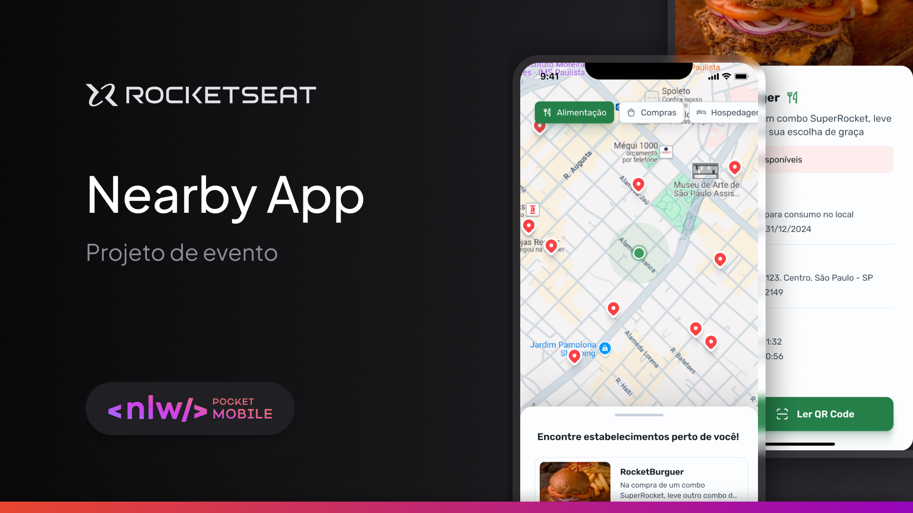

  

  <a href="#-tecnologias">Tecnologias</a>&nbsp;&nbsp;&nbsp;|&nbsp;&nbsp;&nbsp;
  <a href="#memo-licença">Licença</a>

## 🚀 Tecnologias

- TypeScript
- React Native
- Expo

## 🎨 Layout:

Figma: https://www.figma.com/design/x9d9zpgs40HAqE4Ng2yfhM/NLW-Pocket-Mobile-%E2%80%A2-Nearby-(Community)?node-id=0-1&t=Pby68i4jMN4QZXip-1

## :memo: Licença

Esse projeto está sob a licença MIT. Veja o arquivo [LICENSE](LICENSE) para mais detalhes.

---

Feito com ♥ by joaoD3V
